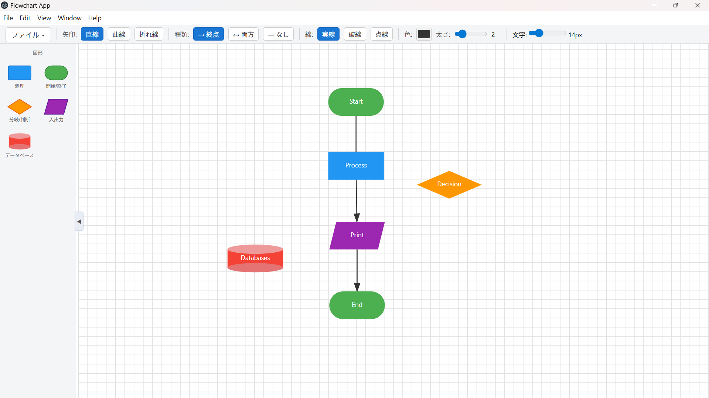

# Flowchart App (Electron + SVG)

ElectronとSVGを使用したフローチャートエディタです。SVGキャンバス上でノードを配置・接続し、フローチャートをインタラクティブに作成・編集できます。

---

## スクリーンショット



---

## 使用技術

- **Electron**
- **Node.js**
- **SVG (DOM API)**
- **Vanilla JavaScript**

---

## セットアップ

**動作要件:** Node.js 18以上 / Electron 28以上

1. 依存インストール
   ```bash
   npm install
   ```

2. 起動
   ```bash
   npm start
   ```

---

## ファイル構成

もともと1つの `renderer.js` に実装されていた機能を、責務ごとに以下のファイルへ分割しています。

```
flowchart-app/
├── main.js          # Electronメインプロセス
├── index.html       # UIレイアウト・ツールバーHTML・スクリプト読み込み順序の定義
├── state.js         # グローバル状態管理
├── canvas.js        # SVGキャンバス初期化・グリッド描画・座標変換
├── edge.js          # エッジ（矢印）の生成・描画・スタイル管理
├── node.js          # ノードの描画・ドラッグ・編集・リサイズ・接続
├── viewport.js      # パン・ズーム・矩形選択
├── toolbar.js       # ツールバーUIのイベント処理
├── fileio.js        # JSON形式での保存・読み込み
└── package.json
```

### `main.js` — Electronメインプロセス

Electronアプリのエントリポイントです。`BrowserWindow` を生成し、`index.html` を読み込みます。ウィンドウのサイズ設定やライフサイクルイベント（全ウィンドウ閉鎖時の終了、macOSでの再アクティベート）を管理します。

### `index.html` — UIレイアウト

ツールバーのHTML構造（アコーディオンメニュー・矢印スタイルボタン・スライダーなど）と、SVGキャンバス領域、エッジ選択パネルを定義します。また、各JavaScriptファイルの**読み込み順序**を管理しており、依存関係の都合上この順序を変更してはいけません。

| 読み込み順 | ファイル | 理由 |
|:---:|---|---|
| 1 | `state.js` | 他の全ファイルが参照するグローバル変数を先に定義 |
| 2 | `canvas.js` | SVGグループと変換関数を初期化 |
| 3 | `edge.js` | ノードより先にエッジ関数を定義（ノードが参照するため） |
| 4 | `node.js` | エッジ関数を利用してノードを描画 |
| 5 | `viewport.js` | キャンバスが存在する状態でパン・ズームを設定 |
| 6 | `toolbar.js` | 全関数が揃った後にUIイベントを設定 |
| 7 | `fileio.js` | 保存・読み込み機能を最後に登録 |

### `state.js` — グローバル状態管理

アプリ全体で共有される状態変数をまとめて定義します。各モジュールはこのファイルの変数を直接参照・更新します。

**主な変数:**

| 変数 | 説明 |
|---|---|
| `nodes` / `edges` | ノード・エッジのデータ配列 |
| `selectedNode` / `selectedEdge` | 現在選択中のノード・エッジ |
| `selectedNodes` | 矩形選択などで複数選択中のノードの `Set` |
| `viewX` / `viewY` / `viewScale` | 無限キャンバスのパン・ズーム状態 |
| `globalEdgeStyle` / `globalArrow` / `globalDash` / `globalColor` / `globalWidth` | 新規エッジに適用されるデフォルトスタイル |
| `isPanning` / `spaceDown` | パン操作の状態フラグ |
| `bezierDragging` / `bezierEdge` | ベジェ制御点ドラッグの状態 |

### `canvas.js` — SVGキャンバス初期化・グリッド描画・座標変換

SVGの各レイヤー（グリッド・エッジ・ノード）をグループとして生成し、描画順序を管理します。また、ドット背景グリッドの再描画、スクリーン座標と論理座標の相互変換、矢印マーカー（`<marker>`）の動的生成を担当します。

**主な関数:**

| 関数 | 説明 |
|---|---|
| `applyTransform()` | パン・ズームをSVGの `transform` 属性に反映し、グリッドを再描画 |
| `drawGrid()` | 現在のビュー変換に合わせてグリッド線を再描画 |
| `screenToLogical(sx, sy)` | スクリーン座標をSVG論理座標へ変換 |
| `getOrCreateMarkerEnd(color)` | 指定色の終点矢印マーカーを取得または生成 |
| `getOrCreateMarkerStart(color)` | 指定色の始点矢印マーカーを取得または生成 |

### `edge.js` — エッジの生成・描画・スタイル管理

ノード間を結ぶエッジ（矢印線）のすべてを管理します。パスの計算・SVG要素の生成・スタイル適用に加え、ベジェ曲線・折れ線の制御点ドラッグ、画面下部に表示される「エッジ選択パネル」のイベント処理も担当します。

**主な関数:**

| 関数 | 説明 |
|---|---|
| `createEdge(a, b, opts)` | 2つのノード間にエッジを生成し `edges` 配列に追加 |
| `buildPath(edge)` | スタイル（直線 / ベジェ / 折れ線）に応じたSVGパス文字列を生成 |
| `updateEdgePath(edge)` | エッジのSVGパス要素を再描画 |
| `updateEdges()` | 全エッジを再描画（ノード移動時などに呼び出す） |
| `applyEdgeStyle(edge)` | 色・太さ・破線・矢印マーカーをSVG属性として適用 |
| `selectEdge(edge)` | エッジを選択状態にし、エッジパネルを表示 |
| `toggleConnection(a, b)` | 同じ組み合わせのエッジが存在すれば削除、なければ生成 |
| `showCPDot(edge)` / `hideCPDot(edge)` | ベジェ・折れ線の制御点ドットを表示・非表示 |

### `node.js` — ノードの描画・ドラッグ・編集・リサイズ・接続

ノードのライフサイクル全般を管理します。形状（矩形・角丸・菱形・平行四辺形・シリンダー）のSVG要素生成から、ドラッグ移動・ダブルクリックによるラベル編集・リサイズハンドル・クリックによるノード接続（エッジ生成のトリガー）・キーボードによる削除まで担当します。

**主な関数:**

| 関数 | 説明 |
|---|---|
| `drawNode(node)` | ノードのSVG要素を生成してキャンバスに追加 |
| `createShapeEl(node)` | 形状に応じたSVG要素（`rect` / `polygon` / `g`）を生成 |
| `updateNodePosition(node)` | ノードの位置・サイズをSVG属性に反映 |
| `enableDrag(el, node)` | ドラッグ移動（複数選択対応・端スクロール付き）を有効化 |
| `enableConnect(el, node)` | クリックによるノード選択・エッジ接続を有効化 |
| `enableEdit(el, node)` | ダブルクリックによるラベルインライン編集を有効化 |
| `deleteNode(node)` | ノードと関連エッジを削除 |
| `showResizeHandles(node)` / `hideResizeHandles()` | リサイズハンドルを表示・非表示 |
| `clearSelection()` | ノード・エッジの選択状態をすべてリセット |

**対応形状:**

| `shape` 値 | 形状 | 用途 |
|---|---|---|
| `rect` | 矩形 | 処理 |
| `rounded` | 角丸矩形 | 開始・終了 |
| `diamond` | 菱形 | 分岐・判断 |
| `parallelogram` | 平行四辺形 | 入出力 |
| `cylinder` | シリンダー | データベース |

### `viewport.js` — パン・ズーム・矩形選択

キャンバス全体の視点操作を担当します。スペースキーを押しながらドラッグするパン操作、Ctrl+ホイールによるズーム、背景の長押し（200ms）またはドラッグによる矩形選択をそれぞれ実装しています。

**操作まとめ:**

| 操作 | 動作 |
|---|---|
| スペース + ドラッグ / 中クリックドラッグ | キャンバスをパン |
| Ctrl + ホイール | ズームイン・アウト（マウス位置を中心に） |
| ホイール | キャンバスをスクロール |
| 背景を長押し or ドラッグ | 矩形選択（複数ノードを一括選択） |
| 背景をクリック | 選択状態のリセット |

### `toolbar.js` — ツールバーUIのイベント処理

ツールバーの各コントロール（矢印スタイル・矢印種類・線種・線色・太さ・文字サイズ・図形追加ボタン）のイベントを管理します。操作はグローバルエッジ設定（`state.js`）を更新すると同時に、エッジが選択中の場合はそのエッジにも即時反映します。

### `fileio.js` — JSON形式での保存・読み込み

フローチャートの状態をJSON形式でファイルに書き出す保存機能と、JSONファイルを読み込んで全ノード・エッジを復元する読み込み機能を提供します。

**保存データの構造:**

```json
{
  "nodeId": 5,
  "nodes": [
    { "id": 1, "x": 100, "y": 80, "w": 120, "h": 60, "label": "開始", "fontsize": 14, "shape": "rounded" }
  ],
  "edges": [
    { "aId": 1, "bId": 2, "style": "bezier", "arrow": "end", "dash": "solid", "color": "#333333", "width": 2, "cpOffX": 0, "cpOffY": -30 }
  ]
}
```

---

## 実装済み機能

- ノード追加（5種類の形状：処理・開始終了・分岐・入出力・データベース）
- ドラッグ移動（複数選択対応・端スクロール付き）
- ノード間接続（矢印）・矢印削除
- スナップ整列
- ノード名編集（ダブルクリックによるインライン編集）
- 保存 / 読み込み（JSON形式）
- ズーム / パン（無限キャンバス）
- ノード削除（Backspaceキー）
- 矢印スタイル（直線・ベジェ曲線・折れ線）とベジェ制御点のドラッグ調整
- 矢印種類（終点のみ・両方・なし）・線種（実線・破線・点線）・色・太さのカスタマイズ

---

## 今後の実装機能

- [ ] Undo / Redo
- [ ] 右クリックメニュー
- [ ] グループ化
- [ ] 自動レイアウト
